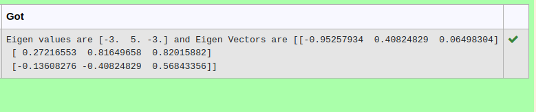

# EIGENVALUES-AND-EIGENVECTORS
## Aim:
To write a python program to find the Eigenvalues and Eigen Vectors
## Equipment’s required:
1. 	Hardware – PCs
2. 	Anaconda – Python 3.7 Installation / Moodle-Code Runner
## Algorithm:
Step1 : import numpy as np

Step 2: get input as a=np.array(eval(input()))

Step 3: Using the np.linalg.eig(), we get two results (first is eigenvalue and second is eigenvector) of the given matrix.

Step 4: print the eigenvectors and eigen values by the print statement

## Program:
```
import numpy as np
a = np.array([[-2,2,-3],[2,1,-6],[-1,-2,0]])
value,vector = np.linalg.eig(a)
print("Eigen values are",value,"and Eigen Vectors are",vector)

```


## Output:

## Result:
Thus the Eigenvalue and Eigenvector is successfully solved using python program
